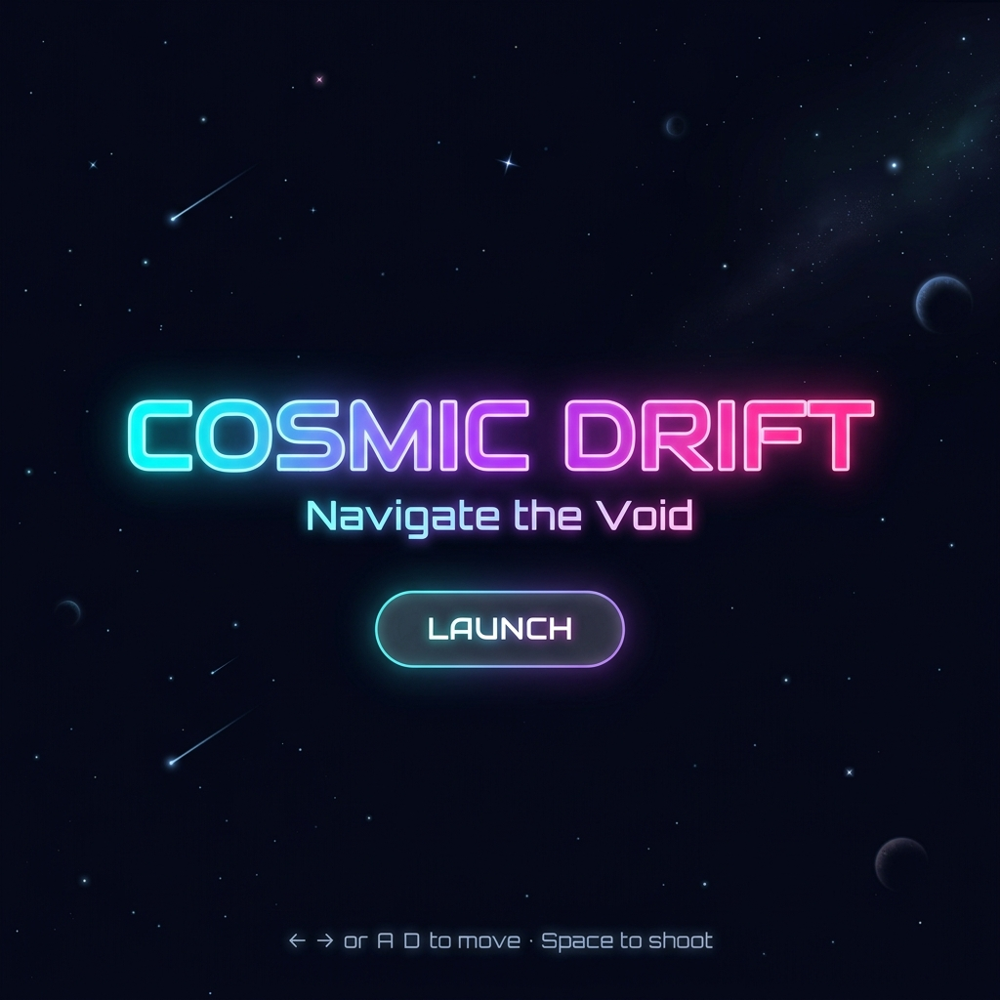
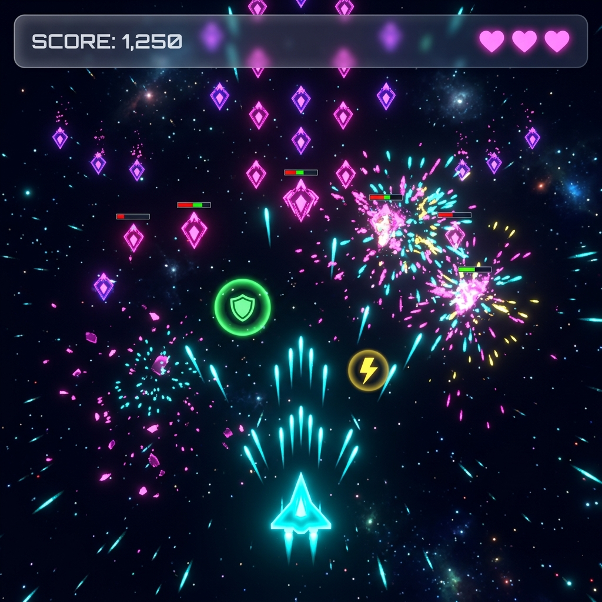

<div align="center">

# 🚀 Cosmic Drift

### *Navigate the Void*

A neon-themed space arcade mini game built with vanilla **HTML5 Canvas**, **CSS3**, and **JavaScript** — zero dependencies, pure browser-native performance.

[](LICENSE)
[](https://developer.mozilla.org/en-US/docs/Web/API/Canvas_API)
[](https://developer.mozilla.org/en-US/docs/Web/CSS)
[](https://developer.mozilla.org/en-US/docs/Web/JavaScript)

---

[**Play Now**](#getting-started) · [**Features**](#-features) · [**Controls**](#-controls) · [**Contributing**](#-contributing)

</div>

---

## 📸 Preview

<div align="center">
  
  <br><br>
  
</div>

> *Screenshots are illustrative — the actual game is even better in motion!*

---

## ✨ Features

| Feature | Description |
|---------|-------------|
| 🎮 **Smooth Gameplay** | 60 FPS canvas-based rendering with delta-time synchronization |
| 🌌 **Parallax Starfield** | Multi-layered animated star background that reacts to game state |
| 🛸 **3 Enemy Types** | Drones, cruisers, and armored tanks with distinct behaviors |
| ⚡ **Power-Up System** | Shields (🟢), rapid fire (🟡), and extra lives (🩷) |
| 🔥 **Combo Multiplier** | Chain kills for escalating score multipliers with on-screen popups |
| 💥 **Particle Effects** | Explosions, thrust trails, and impact flashes |
| 📱 **Mobile Support** | Touch controls with auto-fire for mobile/tablet play |
| 🏆 **Persistent Scores** | High scores saved via `localStorage` |
| 🎨 **Glassmorphism UI** | Frosted-glass HUD with gradient neon typography |
| 📈 **Dynamic Difficulty** | Enemy speed and spawn rates increase per level |

---

## 🕹️ Controls

### Desktop

| Key | Action |
|-----|--------|
| `← →` or `A` `D` | Move ship left / right |
| `Space` | Fire bullets |
| `Enter` | Restart (game over screen) |

### Mobile / Tablet

| Gesture | Action |
|---------|--------|
| Drag left / right | Move ship |
| Automatic | Auto-fire while touching |

---

## 🚀 Getting Started

### Prerequisites

- A modern web browser (Chrome, Firefox, Safari, Edge)
- No build tools, package managers, or servers required

### Quick Start

```bash
# Clone the repository
git clone https://github.com/CoolDudeMaruf/cosmic-drift.git

# Navigate to the project directory
cd cosmic-drift

# Open in your browser
# Option 1: Double-click index.html
# Option 2: Use a local server (recommended)
npx serve .
```

> 💡 **Tip:** Using a local server avoids potential CORS issues and better simulates production.

### Deploy to GitHub Pages

1. Push this repository to GitHub.
2. Go to **Settings → Pages**.
3. Set source to **Deploy from a branch** → `main` / `root`.
4. Your game will be live at `https://CoolDudeMaruf.github.io/cosmic-drift/`

---

## 📁 Project Structure

```
cosmic-drift/
├── index.html              # Main entry point
├── css/
│   └── style.css           # All styling (glassmorphism, HUD, screens)
├── js/
│   └── game.js             # Game engine (canvas, physics, input, loop)
├── assets/
│   ├── favicon.svg         # Browser tab icon
│   ├── og-preview.png      # Social media preview (placeholder)
│   ├── screenshot-start.png
│   └── screenshot-gameplay.png
├── README.md               # This file
├── LICENSE                 # MIT License
├── CONTRIBUTING.md         # Contribution guidelines
├── CODE_OF_CONDUCT.md      # Community standards
├── CHANGELOG.md            # Version history
└── .gitignore              # Git ignore rules
```

---

## 🧠 Architecture

The game engine is a single-file IIFE (`js/game.js`) that manages:

```
┌────────────────────────────────────────────┐
│               Main Loop (rAF)              │
├────────────┬───────────────────────────────┤
│  Background│        Game Layer             │
│  Starfield │  ┌─────────┐ ┌─────────────┐ │
│            │  │  Input   │ │  Collision   │ │
│  (bgCtx)   │  │ Handler  │ │  Detection   │ │
│            │  └────┬─────┘ └──────┬──────┘ │
│            │       │              │        │
│            │  ┌────▼─────┐ ┌──────▼──────┐ │
│            │  │  Player  │ │  Enemies    │ │
│            │  │  Ship    │ │  & PowerUps │ │
│            │  └────┬─────┘ └──────┬──────┘ │
│            │       │              │        │
│            │  ┌────▼──────────────▼──────┐ │
│            │  │   Particle System        │ │
│            │  │   (explosions, thrust)   │ │
│            │  └──────────────────────────┘ │
├────────────┴───────────────────────────────┤
│        HUD (DOM, glassmorphism CSS)        │
└────────────────────────────────────────────┘
```

---

## 🎨 Design System

| Token | Color | Usage |
|-------|-------|-------|
| `--neon-cyan` | `#00f0ff` | Player ship, bullets, primary accents |
| `--neon-pink` | `#ff2d95` | Drone enemies, lives, explosions |
| `--neon-purple` | `#b44dff` | Cruiser enemies, gradients |
| `--neon-green` | `#39ff14` | Shield power-up, health bars |
| `--neon-yellow` | `#ffe600` | Rapid fire power-up, high score |
| `--bg-deep` | `#0a0a1a` | Primary background |

**Typography:** [Orbitron](https://fonts.google.com/specimen/Orbitron) (headings, HUD values) · [Rajdhani](https://fonts.google.com/specimen/Rajdhani) (body, labels)

---

## 🤝 Contributing

Contributions are welcome! Please read the [Contributing Guide](CONTRIBUTING.md) and follow our [Code of Conduct](CODE_OF_CONDUCT.md).

```bash
# Fork → Clone → Branch → Code → Push → PR
git checkout -b feature/your-feature
git commit -m "feat: add your feature"
git push origin feature/your-feature
```

---

## 📄 License

This project is licensed under the **MIT License** — see the [LICENSE](LICENSE) file for details.

---

<div align="center">

Made with 💜 and vanilla JavaScript

**[⬆ Back to Top](#-cosmic-drift)**

</div>
